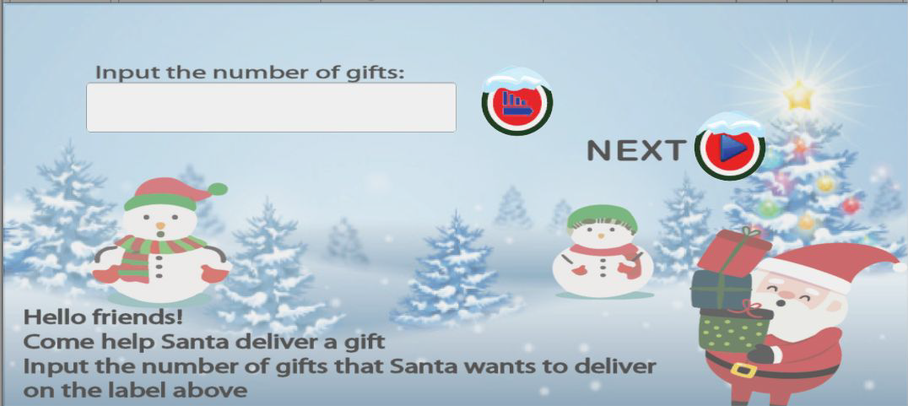
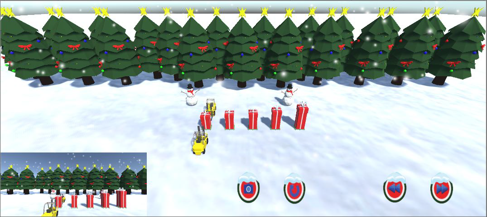
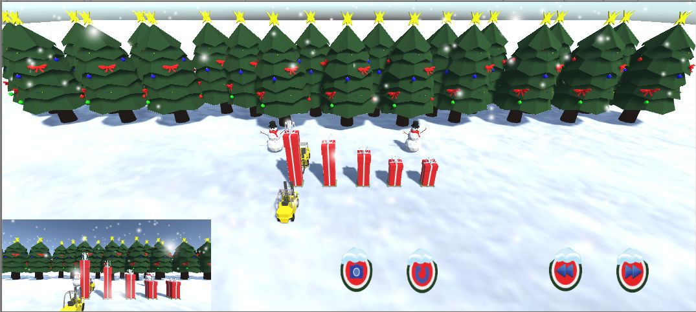

## Merry Quicksort
Simulation app about quicksort designed with santa claus theme built using Unity.

## Features
* Quicksort Input
  * Input number of gifts to be sorted and choose sorting mode by ascending or descending
* Start, Stop, Reset
  * Start, stop, or reset the simulation
* Slow Motion and Fast Forward
  * Increase or decrease the speed of simulation
* Camera View
  * Select preferred camera view from front, top, or in-truck camera
* Dialog
  * Show santa’s dialog at bottom of the screen

## Demo

 

  

 

 

  

 

 

  

 

 

  

 

 

  

 

## Contributors
* Benny Richardson
* Kevin Hendy
* Ventryshia Andiyani
* Wilson Philips
